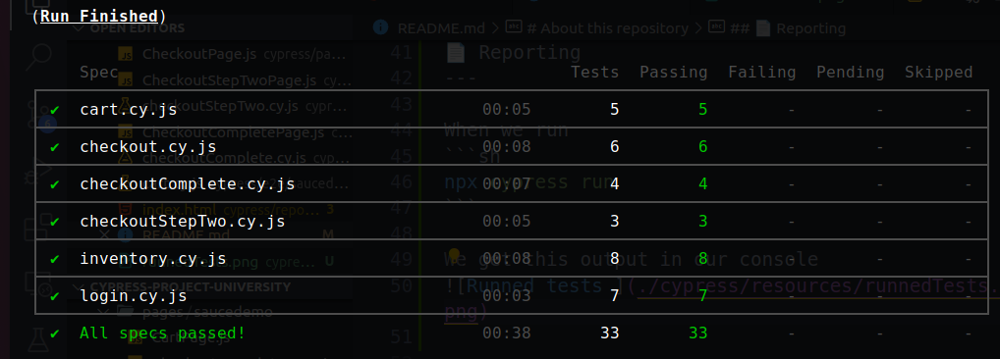
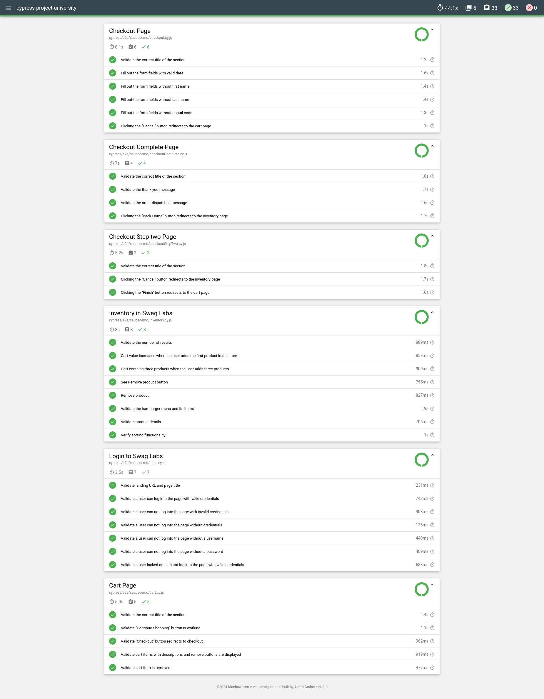
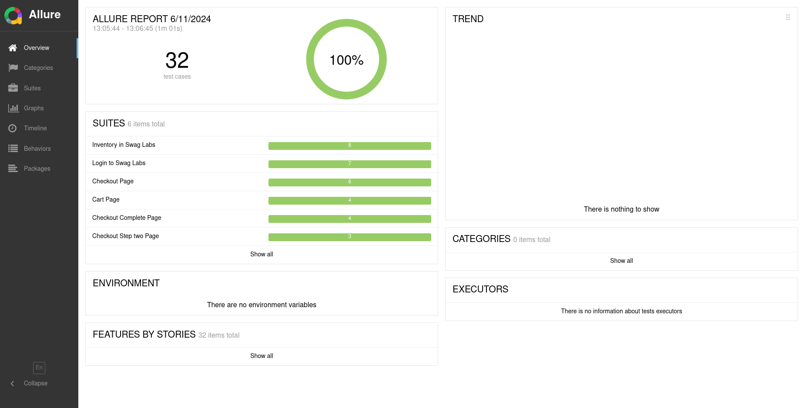
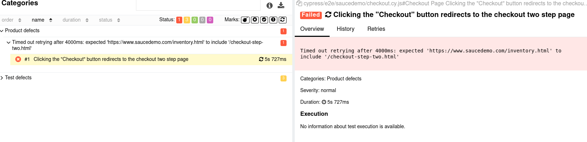

About this repository
==================
This repository contains the final exercise for the course QA & Testing from Hiberus University.

🌳 Cypress
---

This project uses [Cypress](https://www.cypress.io/) for end-to-end testing. We are working with [Sauce demo](https://www.saucedemo.com//)

## Getting Started

To get started with this project, clone the repository and install the dependencies:

```sh
git clone https://github.com/yourusername/your-repo.git
cd your-repo
npm install
npx cypress open
```

✅ How I run the tests?
---

All tests: 
```sh
npx cypress run
```
All Sauce demo tests: 
```sh
npm run e2e:all
```
Login: 
```sh
npm run e2e:login
```
Inventory:
```sh
npm run e2e:inventory
```

📄 Reporting
---

When we run 
```sh
npx cypress run
```

We get this output in our console


Also we generated a report with **Mochawesome** in reports/html that looks like this:


If we want an Allure report, we can throw the command 

```sh
npx allure serve allure-results/
```
and we'll get this report:


We can see more details when a test failed


🔍 To improve
---

- Many more tests, especially in the cart page
- Separate some common components in each page, like the hamburger menu, the footer
- Write tests with metadata or runtime API for improving Allure Report
